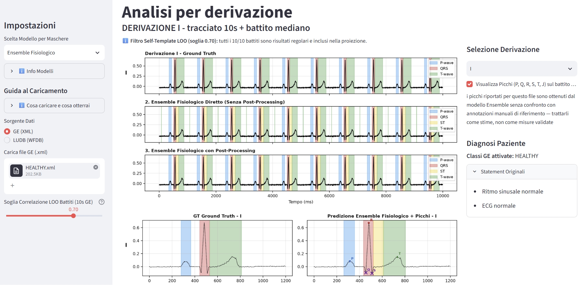
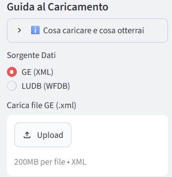
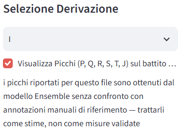
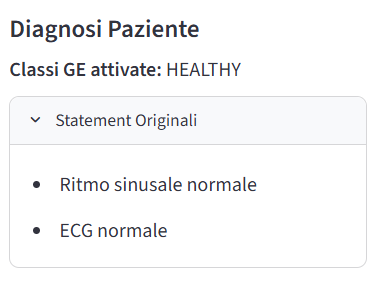
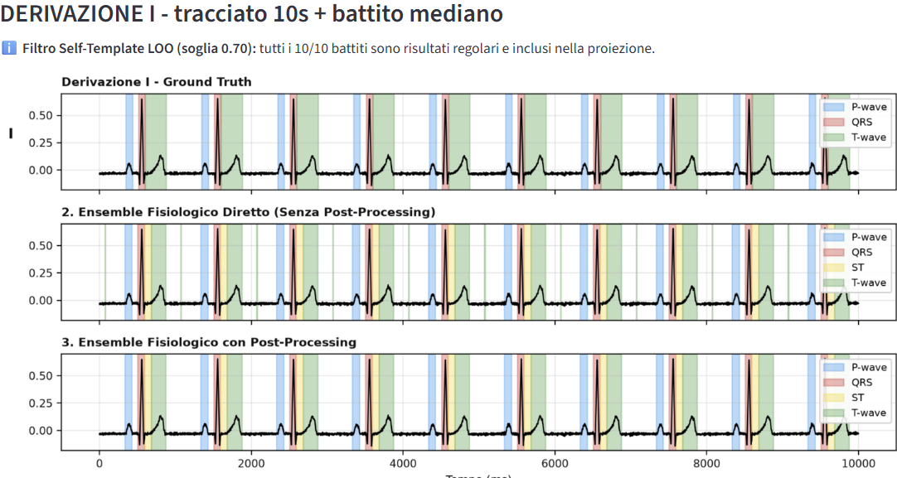
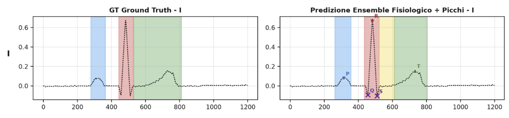
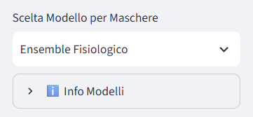
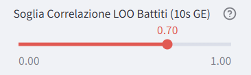

# ECG AI Segmentation & Analysis App

Benvenuto/a nella repository pubblica dell'app di analisi e segmentazione automatica per segnali ECG.

Questa applicazione sfrutta un ensemble di reti neurali profonde (basate su architettura U-Net 1D) per riconoscere e segmentare le onde elettrocardiografiche (P, QRS, T) con precisione clinica, elaborando sia tracciati continui a 10 secondi sia battiti mediani sintetici.

## Prova l'App
L'applicazione è interamente ospitata su Streamlit Community Cloud. Non hai bisogno di installare nulla in locale.

**[CLICCA QUI PER AVVIARE L'APP](https://ecganalyzer.streamlit.app/)**

---

## Tour dell'App e Funzionalità

Esplora le principali caratteristiche della nostra interfaccia clinica interattiva:

### 1. Dashboard e Visione d'Insieme

*La schermata principale offre una visione completa e pulita di tutte le 12 derivazioni, affiancando i referti automatici ai grafici ad alta risoluzione.*

### 2. Caricamento del File (GE XML & WFDB)

*Supporto multi-formato: trascina direttamente i tuoi file clinici XML (come quelli esportati dalle macchine GE MAC2000) o i classici formati MIT-BIH (WFDB `.dat` e `.hea`).*

### 3. Selezione Derivazione e Controllo Picchi

*Un'interfaccia focalizzata: scegli quale derivazione analizzare nel dettaglio e decidi con un clic se sovrapporre le etichette dei picchi (P, Q, R, S, T, J) sulle predizioni della rete.*

### 4. Diagnosi Paziente e Filtri Intelligenti

*Estrazione automatica dei metadati e del referto testuale (Statements). Se il sistema rileva patologie specifiche (es. Fibrillazione Atriale - `NO_P`), adatta dinamicamente l'output sopprimendo la ricerca dell'onda P.*

### 5. Analisi del Tracciato Continuo (10s)

*Tutto il tracciato viene segmentato battito per battito, rivelando la stabilità spaziale e temporale della predizione lungo l'intero asse dei 10 secondi.*

### 6. Battito Mediano e Separazione Clinica (ST/T)

*Confronto diretto tra Ground Truth e Predizione sul battito mediano. L'Ensemble Fisiologico distingue separatamente il QRS, il tratto isoelettrico ST (giallo) e l'onda T (verde), superando i limiti delle annotazioni automatiche classiche.*

### 7. Scelta del Modello (Ensemble vs Baseline)

*Analizza lo stesso battito con reti neurali diverse: passa dall'Ensemble Clinico alle varie reti Baseline e osserva l'effetto della Knowledge Distillation.*

### 8. Filtro Self-Template (LOO Correlation)

*Affidabilità prima di tutto: imposta la soglia di correlazione per il filtro LOO (Leave-One-Out). I battiti fortemente anomali, ectopici o mascherati da artefatti vengono automaticamente esclusi dal calcolo continuo.*

---

## Come iniziare
1. Apri l'app dal link qui in alto.
2. Scegli il formato dal pannello a sinistra (es. **GE XML**).
3. Trascina il tuo elettrocardiogramma nel riquadro.
4. Esplora liberamente!

*Nota: Il codice sorgente e i pesi delle reti neurali sono mantenuti privati per scopi di ricerca e tesi.*
